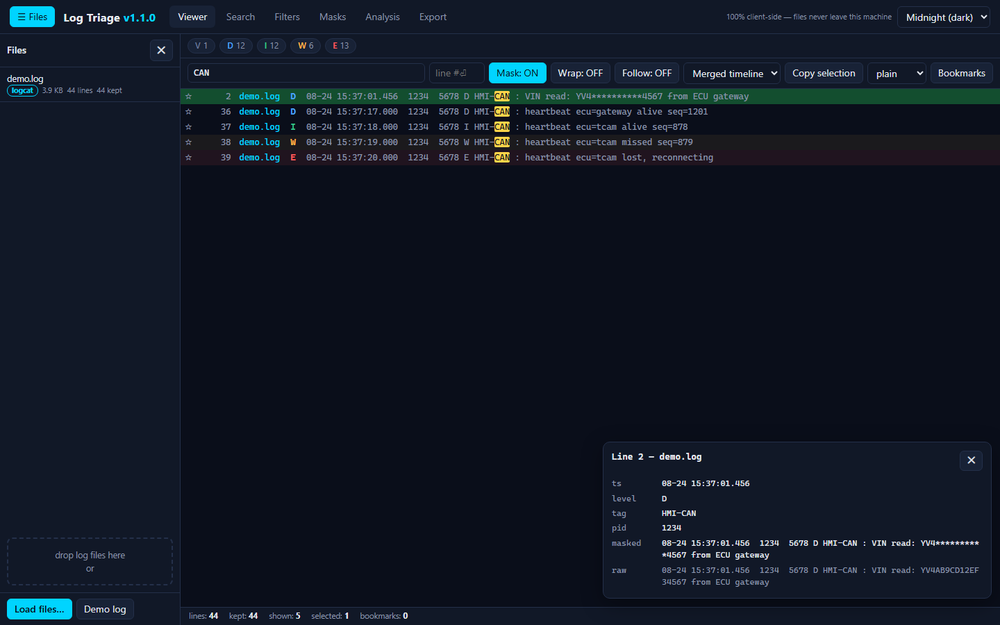
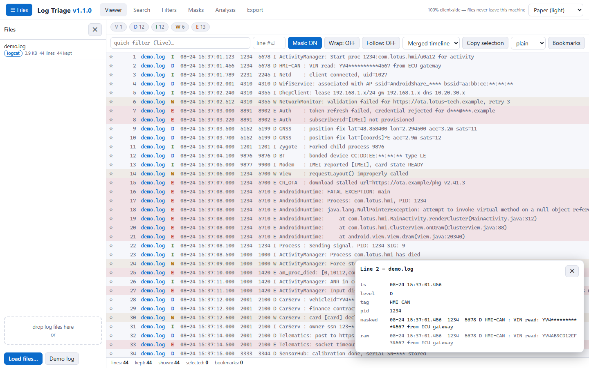
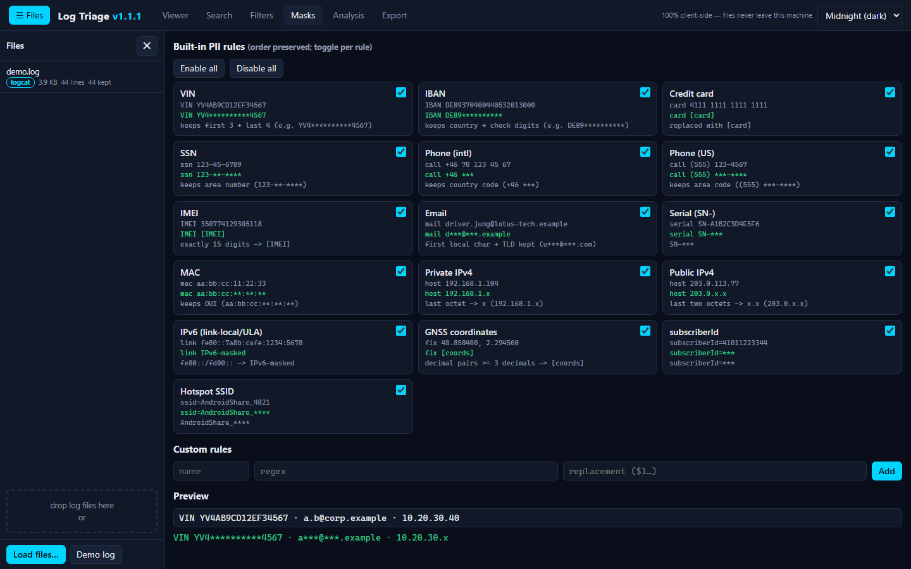
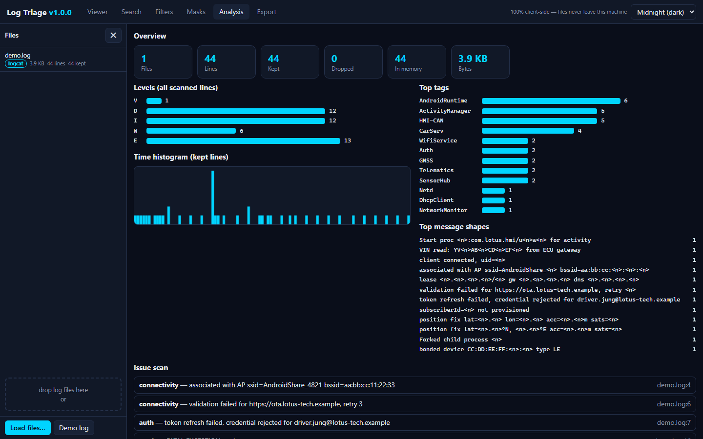
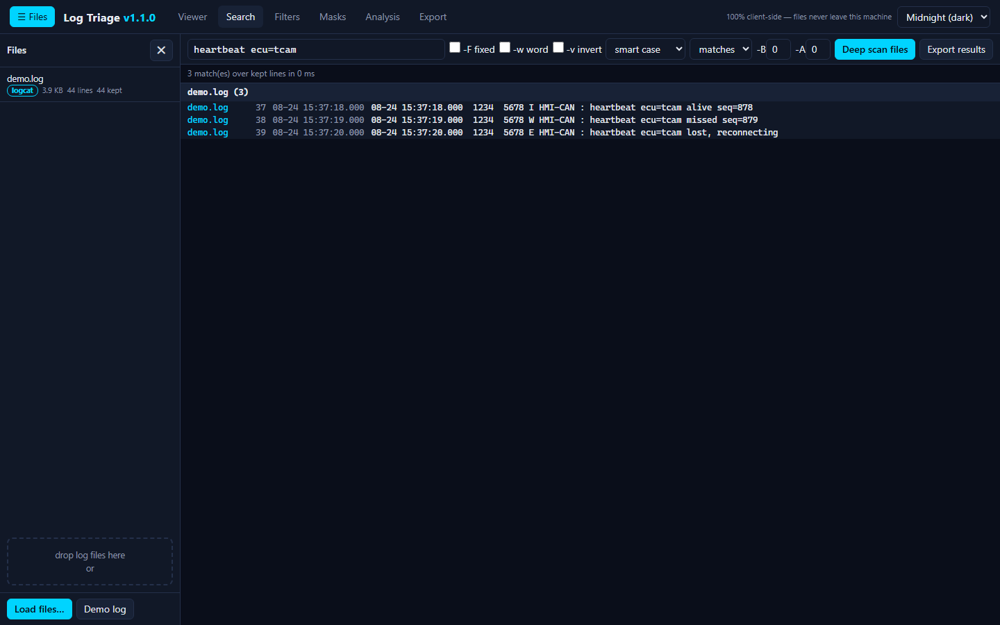

<!-- version: 1.35.0 -->

# Log Triage

**Live app: https://cj-1981.github.io/log-triage/** — open it, drop a log file, done. The page is deployed automatically by CI from `main`.

**Log Triage** is a privacy-first log triage tool that runs entirely in your browser. Drop one or more log files onto a single self-contained HTML page and get instant format detection, parsing, filtering, ripgrep-style search, PII masking, analysis, and sanitized export — with no server, no uploads, and no telemetry. Your files never leave your machine.

Current release: v1.35.0

## Screenshots

**Viewer** — virtualized log table with severity badges, dynamic level chips, quick-filter match highlighting, bookmarks, and the line detail drawer (dark "Midnight" theme):



The same viewer in the light **Paper** theme:



**Masks** — the 16 built-in PII rules with live input→output examples, custom regex→template rules, and a preview box:



**Analysis** — counters, level distribution, canvas time histogram, top tags and message shapes, issue scan, and the PII census:



**Search** — ripgrep-style flags, instant results grouped by file as `file:lineNo:`, deep scan from disk, and click-to-jump:



## Quick start

- **Use it:** open `log-triage.html` in any modern browser. No installation, no server, no network access required.
- **Rebuild it:** from the repository root, run:

  ```sh
  node build.js
  ```

  This concatenates the `src/` UMD modules (plus CSS, shared test cases, and demo data) into a fresh single-file `log-triage.html`.

**Browser requirements:** any modern Chromium-based browser or Firefox; Safari 16.4+ (lookbehind regexes). Node.js 22 is required **only** for building and running tests. The generated HTML file is fully self-contained and runs anywhere, including offline from `file://`.

**On mobile:** the files panel opens via the header "☰ Files" toggle and overlays the viewer; wrap mode reflows long lines to the column width.

## Color highlighters

1. Open **Filters** and choose **+ Add highlighter**.
2. Enter a pattern and choose **literal** for ordinary text or **regex** for a regular expression. The case toggle applies to either mode.
3. Choose **text** to color only matching characters or **row** to tint the complete log row.
4. Pick one of the eight preset swatches, or use the custom color control for any other color. The selected swatch has an accent ring.
5. Use the **on** checkbox to temporarily disable the highlighter without deleting it.

Highlighters are additive presentation rules: they never remove lines or change the matching-line count. Matching runs on the masked display text and repaints the current 500-line page without rescanning the source file; the same rules apply as paging continues through the complete result set. Earlier highlighter rules win when colored text ranges overlap. Rules and their `matchMode`, `target`, and `color` fields persist in local state, named presets, and Config-tab JSON export/import.

## Features overview

- **Multi-file loading** — sequential ingestion with per-file and overall progress, cancel support, and exact per-file counters. Drag & drop accepts loose files and whole folders: dropped folders are walked recursively and their files ingest under folder-relative names (`logs/sub/b.log`), so same-named logs from different folders stay distinct. Every file is fully indexed by a dedicated paging worker (columnar line offsets/timestamps/levels, Float64 so multi-GB offsets stay exact); the whole indexed file — not a capped in-memory window — is the viewing and filtering scope. A configurable per-file "analysis sample" (default 100,000 lines, head + newest tail) bounds the analysis-tab data only.
- **Format autodetection** — Android logcat threadtime, syslog (RFC 3164), Apache CLF, ISO-8601, bare `MM-DD`, and plain text with timestamps normalized to a year-less `MM-DD HH:MM:SS.mmm` form.
- **Ripgrep-style search** — instant search over kept lines plus a deep-scan mode that re-streams files from disk with `-F` (fixed strings), smart-case default (`-i` / sensitive), `-w` whole word, `-v` invert, `-B`/`-A` context, and normal / `-c` count / `-l` files-with-matches modes. Results are capped (default 10,000), grouped by file as `file:lineNo:` in collapsible per-file groups (Collapse all / Expand all, match counts in headers), and exportable as rg-style text or JSON. Every rg flag control carries a hover tooltip explaining the option in plain language for users unfamiliar with ripgrep.
- **PII masking** — 16 built-in ordered regex rules (VIN, IBAN, credit card, SSN, international and US phone, IMEI, email, device serial `SN-`, MAC with OUI kept, private/public IPv4, IPv6 link-local/ULA, GNSS decimal pairs, subscriberId, hotspot SSID `AndroidShare_`), individually toggleable, plus custom regex-to-template rules. Masking is applied lazily over raw stored text and toggled in the viewer with the `M` key. An extensible `PiiProvider` registry supports the local regex engine (default, fully offline) plus remote backends — Presidio sidecar and LLM API with CORS proxy mode in the Providers tab (FR-25, ADR-0010).
- **Filter engine and color highlighters** — ordered rules support include (OR), exclude (subtractive), and additive highlighting. Highlight rules can use literal text or regex, paint matching text or the whole row, choose any color, and remain independent of the shown-line count. Rules persist in presets and configuration exports. Dynamic level chips are generated from the levels actually observed in each load, and an inclusive time range narrows the view by timestamp prefix comparison.
- **Analysis tab** — level bars, top tags, top messages via pattern normalization (numbers/hex/UUIDs stripped to cluster similar lines), a canvas time histogram with y-axis gridlines and value ticks, x-axis time labels, and a hover tooltip (count + time range; device-pixel-ratio aware), issue scanning for crashes/ANRs/process deaths/connectivity/auth problems (the auth group also detects `failed password` and `password check failed`) plus built-in groups for suspend-to-RAM transitions and failures (kernel `PM: suspend entry/exit`, wake reasons, `Freeze of tasks` aborts, `abort_suspend`), native crash signals (`Fatal signal`, `crash_dump`, kernel panic), memory pressure (lmkd/lowmemorykiller/OOM), ANR event-log records (`am_anr`, `Force finishing`), binder transaction failures, SELinux denials (`avc: denied`, `SecurityException`), watchdog kills, thermal throttling/shutdown, storage exhaustion (`ENOSPC`, `INSTALL_FAILED`), boot loops/restart reasons, and modem subsystem restarts — 14 groups total, each individually toggleable and editable, an issue-scan rule editor (enable, edit kind and case-insensitive pattern, delete, add-rule, restore-defaults; bad patterns skipped safely; saved in state and presets), a PII census, and per-file comparison — all scopeable via a file selector (`All files (N)` or one file), with issue entries that click-jump to the line.
- **Viewer** — paged virtualized rendering over every indexed line (500-row pages with a pager bar — First/Previous/page number/Next/Last and a matching-lines range — plus wheel and keyboard paging at page edges), a busy overlay with live percentages and Cancel covering indexing, filtering and page loads, merged-timeline and per-file views, wrap toggle with estimated heights corrected by measuring only rendered rows (extremely long lines display a 2,000-character preview with click-to-open full text in the drawer), six themes (Midnight default, Paper, Solarized Dark, Solarized Light, Monokai, High Contrast) switched from a compact 🎨 icon dropdown in the header, severity badges with W/E/F row tint, multiline selection and copy (click anchor, shift-click range, ctrl-click toggle, ctrl+A; copy with optional `file:lineNo:` prefixes), bookmarks with notes persisted by file identity, a sidebar bookmarks panel (entry list with per-entry ✕ remove, jump-to-line, count pill, and a Clear button that wipes all bookmarks in one click; collapsible with a drag-resize handle), a ★ only-bookmarks chip in the level-chips row (★ + live bookmarked count; appears when bookmarks exist in scope, click toggles the filter; re-filters live), and a detail drawer.
- **Compressed archives (.gz / .tar / .tar.gz / .tgz / .zip / .7z)** — archives are decompressed recursively during load (depth-capped, with progress) and each contained log flows through the normal pipeline; entries keep their archive-relative paths (`bundle/sub/b.log`), and CRC32 digests are verified during 7z/zip extraction so corrupt payloads fail loudly. Top-level `.tar.gz`/`.tgz` bundles extract like any other archive, and a `.tar` file that actually carries gzip bytes (misnamed by the device — seen in TCAM `kmesglog_*.tar`) is detected by magic and decompressed before parsing. Entries over 512 MB are skipped with an announced message — except Android bugreport `dumpstate_board.bin` ramdumps (typically 1.5 GB of binary with embedded text logs): they are stream-converted into a capped 64 MB `dumpstate_board.bin.log` text entry (newest text wins, CRC verified while streaming, the inflated blob never materialized), so the board's logcat/kernel history becomes searchable. `.7z` support is a pure-JS decoder (Copy, LZMA, LZMA2, Deflate coders; plain and compressed headers) — no WASM, no CDN; encrypted or filter-chained archives fail with readable errors.
- **Export sanitized** — `.log`/`.txt` (with `[Ln]` or `file:lineNo:` prefixes), `.csv`, `.json`, rg search results, bookmarks, and selection-only export. Text/csv/json exports cover **every matching line of the current filtered view** (walked from the paging worker with progress), not just the rendered page. Filenames are timestamped `YYYY-MM-DD_HHmmss`. The extract can also be re-packed as an archive mirroring the loaded structure: `.zip`, `.tar`, `.tar.gz`, or `.7z` (stored container, no recompression).
- **Presets** — named filter/mask/search-flag sets persisted in localStorage with JSON import/export.
- **File removal** — per-file ✕ buttons in the files panel drop a file's lines, counters, and level-chip contribution (clear-all uses the same path); removing a file also clears its bookmarks and purges its cache entry.
- **File cache / session restore** — every successfully loaded file is cached in IndexedDB (`log-triage-cache`); reopening the app lists previous files — clicking a cached entry reloads it, while entries whose content is missing render greyed out with a "file not found" badge and a removable ✕.
- **Config tab** — export/import the current filter rules, time range, PII mask setup, and issue-scan rules as one JSON file, with validation, per-section application, a status line, and current-setup cards. The tab also sets the per-file **analysis sample limit** (default 100,000 lines; applies from the next file load) that bounds the analysis tab — viewing, filtering, search, and paging always cover every indexed line regardless of this limit.
- **Responsive mobile layout** — header wraps with horizontally scrollable tabs, the files panel becomes an overlay drawer on narrow screens, and the mask grid stacks to a single column.
- **Debounced search and quick-filter inputs** — matching starts after typing pauses (search 250 ms, quick filter 200 ms). Both fields keep a **search history**: focusing (or typing in) the field opens a dropdown of previous terms (substring-filtered, most recent first, capped at 20, persisted in localStorage) — click an entry or pick it with ↑/↓ + Enter to re-run it. Search results have their own **Wrap: ON/OFF** toggle (independent of the viewer's): ON wraps long matched lines inside the panel, OFF shows one scrollable line per match.
- **Navigation** — click a search result, sidebar bookmark, or issue-scan entry to jump to the line (the viewer loads the page containing it and opens the detail drawer): the per-file selection auto-switches to the matched file and transient filters that would hide the target (quick search, level chips, time range, ★ only-bookmarks) are auto-cleared; a go-to-line box in the viewer toolbar takes a line number + Enter and reaches any indexed line, in files of any size.
- **Files panel filter & sort** — a text box filters the list by file name (live files and cached entries, case-insensitive substring) and a dropdown sorts it by load order, name, size, or line count (ascending/descending); with an active filter that matches nothing, the panel says so.
- **Collapsible files panel** — toggle via the header "☰ Files" button (state persisted; auto-collapsed on narrow screens).
- **Horizontal scrolling in nowrap mode** — the scroll range is sized from the longest line in the view, so long lines are fully reachable instead of ellipsis-truncated.
- **Self-test** — `?selftest` runs the same 131-case suite in the browser that `node --test` executes (`tests/core-cases.js`).

## Privacy and security

- **100% client-side.** All parsing, searching, masking, analysis, and export happen in the browser tab. There is no backend; log files never leave the machine.
- **No network by design.** No CDN assets, no external fonts, no analytics, no telemetry of any kind — the tool works fully offline.
- **Lazy masking.** Raw lines are stored locally; masking is applied only at render/copy/export time, so nothing is rewritten behind your back and unmasked inspection is always explicit.
- **External PII providers are opt-in and off by default.** The local regex engine is the default and works fully offline. The Providers tab can route analysis to a localhost Presidio sidecar (still machine-local) or a remote LLM backend (see `docs/decisions.md`, ADR-0003 and ADR-0010): remote providers show a red warning that data would leave the machine, and the API key is stored only locally and never exported in config files. With the default provider the app makes zero network calls.

## Development

Requirements: Node.js 22.

```sh
npm test          # Unit + bump suites (node:test)
npm run test:gate # Unit tests + coverage gate (>=90% line / >=85% branch on core src modules)
npm run build     # Build log-triage.html from src/
npm run e2e       # Playwright end-to-end tests (63 specs: 55 app + 8 stress)
npm run e2e:stress # Stress suite only (generated big fixture)
npm run bump      # Semver bump from conventional commits (CI runs this automatically on main)
```

- **TDD with quality gates G0–G8.** Development proceeded gate by gate (scaffold, parsing, masking, filters, search, store/timeline/selection/bookmarks, export/bump tooling, themes/UI, e2e hardening) — all complete in v1.0.0. Each gate has entry/exit criteria in `docs/test-plan.md`, and coverage is enforced per core module by `node tools/coverage-gate.mjs`.
- **7z fixture note.** The `.7z`/zip container tests build real archives with the local 7-Zip CLI when it is available (installed as `p7zip-full` in CI; on Windows the suite finds `C:\Program Files\7-Zip\7z.exe`, or set `SEVENZIP_BIN`) and skip cleanly without it — the LZMA codec itself is covered by committed fixtures that need no CLI.
- **Conventional commits.** `feat` → minor, `fix` → patch, `!` or `BREAKING CHANGE` → major. On every push to `main`, GitHub Actions runs test + coverage, build, and e2e, then `tools/bump.mjs` bumps the version, updates `package.json`, the README version marker, and `docs/changelog.md`, tags `vX.Y.Z`, and deploys the release bundle to GitHub Pages.

## Project structure

```
log-triage/
├── log-triage.html        # Built single-file app — open this in a browser
├── build.js               # Concatenates src/ UMD modules into log-triage.html
├── package.json           # npm scripts: test, test:gate, build, e2e, bump
├── src/                   # UMD modules (Node-requireable, browser-safe)
│   ├── _src.js            # Node aggregator exporting all modules for tests
│   ├── util.js            # Shared helpers
│   ├── detect.js          # Format autodetection
│   ├── parser.js          # logcat / syslog / CLF / ISO-8601 / MM-DD / plain parsers
│   └── …                  # masks, pii-provider, filters, levels, search, store,
│                          # timeline, selection, bookmarks, exporter, themes,
│                          # pii-remote (Presidio/LLM adapters),
│                          # archive, lzma, format-7z,
│                          # app.js + app-filecache.js (UI glue)
├── tests/
│   ├── core-cases.js      # Shared case suite — powers node --test AND ?selftest
│   ├── e2e/               # Playwright specs (app.e2e, stress.e2e)
│   └── fixtures/          # demo.log, syslog.log, apache.log, service.log, LZMA hex fixtures
├── tools/
│   ├── coverage-gate.mjs  # Coverage enforcement (>=90% line / >=85% branch)
│   ├── bump.mjs           # Conventional-commit semver bump + tag vX.Y.Z
│   ├── genbig.mjs         # Synthetic big-log generator (stress testing)
│   ├── serve.mjs          # Tiny static server for local browser testing
│   └── shots.mjs          # Screenshot capture for docs
├── docs/
│   ├── img/               # README screenshots (generated by tools/shots.mjs)
│   ├── requirements.md    # FR-1..FR-26, NFR-1..NFR-4, out of scope
│   ├── architecture.md    # Module map, build pipeline, data flow, extension points
│   ├── test-plan.md       # Gates G0–G8, coverage policy, e2e scope, fixtures
│   ├── decisions.md       # ADR-0001..ADR-0011
│   └── changelog.md       # Maintained by tools/bump.mjs
└── .github/
    └── workflows/
        └── ci.yml         # test + coverage → build → e2e → Pages deploy → semver bump
```
