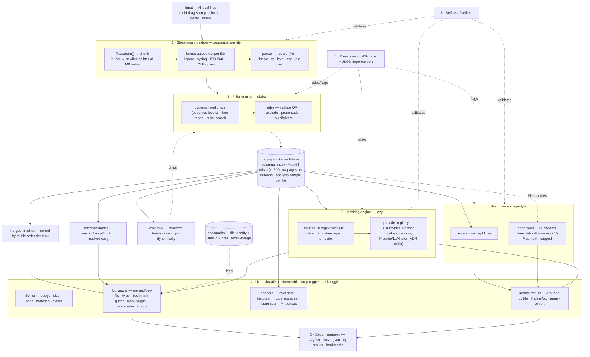

# Architecture

Log Triage is a single-file browser application assembled from small, Node-requireable UMD modules. The same modules power the Node test suite (`node --test`), the in-browser `?selftest` page, and the live UI. All state is local: the kept-line store, bookmarks, and presets live in memory or `localStorage`, and the original `File` handles are retained so deep scan can re-stream from disk.



## Module map

Each `src/*.js` is a UMD module: requireable in Node for TDD, loadable in the browser, and concatenated by `build.js` into the single HTML deliverable.

Implemented (G0–G1):

| Module | Responsibility |
| --- | --- |
| `src/util.js` | Shared helpers (hashing, formatting, small utilities reused by all modules). |
| `src/detect.js` | Format autodetection: logcat threadtime, syslog RFC 3164, Apache CLF, ISO-8601, bare MM-DD, plain. |
| `src/parser.js` | Parsers for the six formats; normalized records (`file · lineNo · ts · level · tag · pid · msg`) with year-less `MM-DD HH:MM:SS.mmm` timestamps. |
| `src/_src.js` | Node aggregator that exports all modules for tests and the coverage gate. |

Implemented in G2–G8:

| Module | Responsibility |
| --- | --- |
| `src/masks.js` | The 16 built-in ordered PII regex rules plus custom regex → template rules; lazy mask application. |
| `src/pii-provider.js` | `PiiProvider` interface, registry, and mock provider (see extension point below). |
| `src/pii-remote.js` | Presidio/LLM request builders, response parsers and offset mapping (FR-25); HTTP injected for testability. |
| `src/filters.js` | Ordered include/exclude filtering, rule compilation, case toggle, and live hit counters; highlight definitions pass through without changing kept-line semantics. |
| `src/highlights.js` | Presentation-only literal/regex highlighter compilation, bounded non-overlapping text spans, whole-row matches, color normalization, and readable foreground selection. |
| `src/levels.js` | Dynamic level tally and chip generation from observed levels; "—" handling for unparseable lines. |
| `src/search.js` | Ripgrep-style search building blocks (`-F -i -w -v`, `-B/-A`, `-c/-l`), capped results; the matcher is shared by the instant tab and the paging worker. |
| `src/paged.js` | Full-file log index: columnar typed arrays (Float64 byte offsets, packed timestamp keys, level codes), streaming line splitter with time-sliced yields and cancellation, on-demand 256-line pages over `File.slice` with a byte-bounded LRU cache, head+tail analysis sampling, and an async merge sort for timeline order. |
| `src/app-paging-worker.js` | The dedicated paging worker: owns indexes, matching (filter engine + search), timeline ordering, page fetches, locate, and removal; emits throttled progress and honours per-request cancellation tokens. |
| `src/app-paging.js` | Browser RPC client for the worker (Blob-URL Worker from the inlined worker bundle; progress-aware promises). |
| `src/store.js` | Analysis-sample store and per-file counters (total/kept/bytes, level tally); the viewer scope is the worker index, not this store. |
| `src/timeline.js` | Merged-timeline ordering (timestamp sort, file-order tiebreak) and the canvas histogram data. |
| `src/selection.js` | Selection model: anchor / shift-range / ctrl-toggle / ctrl+A; masked copy with optional `file:lineNo:` prefixes. |
| `src/bookmarks.js` | Bookmark storage keyed by file identity (name + size + first-line hash), notes, export/import, and `removeAll` behind the bookmarks panel Clear button. |
| `src/exporter.js` | Sanitized exports: `.log`/`.txt`, `.csv`, `.json`, rg results, bookmarks; timestamped filenames. |
| `src/archive.js` | Compressed-archive support (FR-26): detection of `.gz/.tar/.tar.gz/.tgz/.zip/.7z`, recursive extraction with progress, gzip via `DecompressionStream`, tar parse/write, zip central-directory reader (stored + deflate) and stored-entry writer, and re-packing extracts as archives. |
| `src/format-7z.js` | 7z container (FR-26): signature + CRC32 verification, plain and `kEncodedHeader` (compressed) headers, pack/folder/substream/file-info parsing, UTF-16 names, empty files/dirs, digest verification; folder decoding for Copy/LZMA/LZMA2/Deflate coders; stored-entry `.7z` writer. |
| `src/lzma.js` | Pure-JS LZMA1/LZMA2 decoder (ADR-0011): canonical range decoder + probability model, LZMA1 raw streams and chunked LZMA2 with dictionary-reset semantics; no WASM, no external code. |
| `src/themes.js` | Six themes via `body[data-theme]` CSS variables (Midnight default). |
| `src/app.js` (selftest section) | In-browser runner for the shared case suite (`?selftest`) — no separate module; it is part of the app glue. |
| `src/app-*.js` | UI glue: file list, viewer, analysis tab, search results panel, presets UI (exempt from coverage gates). |

The shipped UI glue modules are `src/app.js` and `src/app-filecache.js` (IndexedDB file-cache wrapper for session restore — browser-only; both exempt from the coverage gate, which fails loudly if any other `src/` module produces no coverage row); the dev helpers `tools/serve.mjs` (static server), `tools/shots.mjs` (screenshot capture), `tools/genbig.mjs` (big-log generator — emits deterministic RAREJUMPMARKER lines every 100k lines for stable stress assertions), and `tools/debug-fileswitch.mjs` (deep-scan/file-switch debug probe) support e2e and performance verification and contribute no runtime code.

## Build pipeline

`build.js` produces `log-triage.html` from a template plus module sources by simple concatenation — no bundler, no transpilation, no external dependencies.

- All `src/*.js` modules are UMD so the identical code runs in Node (tests, coverage gate) and the browser.
- Template tokens replaced at build time:
  - `__LT_VERSION__` — the current version string (kept in sync by `tools/bump.mjs` and the README marker `<!-- version: … -->`).
  - `/*__LT_CSS__*/` — inlined stylesheet.
  - `/*__LT_MODULES__*/` — concatenated UMD modules, in dependency order.
  - `/*__LT_CASES__*/` — the shared case suite (`tests/core-cases.js`) inlined for the `?selftest` page.
  - `/*__LT_DEMO__*/` — an inline demo log so the tool is explorable without any local files.

## Shared-case strategy

`tests/core-cases.js` is a plain UMD module defining named test cases (input → expected) over the core modules: detection, parsing, filtering, masking, search, timeline, export, and presets.

- `node --test` consumes the suite through `src/_src.js` and enforces coverage via `node tools/coverage-gate.mjs` (≥ 90% line, ≥ 85% branch per core module).
- `build.js` inlines the same file into `log-triage.html`; opening the app with `?selftest` runs it in the browser.
- Because both runners execute the identical suite, browser and Node behavior cannot drift apart — any behavior change must update one set of cases, and CI plus the in-page self-test report the same verdict.

## Data flow

1. **Ingestion (S1).** Each dropped file is handed to the paging worker, which streams it in 1 MB chunks through a newline splitter (time-sliced yields keep the UI responsive; cancellation aborts mid-stream) and builds a columnar index: Float64 line start offsets, packed timestamp keys, level codes, exact per-file level counts, plus a bounded head+tail analysis sample. Files whose name ends in `.gz/.tar/.tar.gz/.tgz/.zip/.7z` are instead decompressed recursively (`src/archive.js`, `src/format-7z.js`, `src/lzma.js`) and each contained entry re-enters ingestion under its archive-relative path; per-entry progress overlays the ingest and CRC digests verify payloads where the archive defines them.
2. **Filtering (S2).** Filter and search specifications are posted to the worker, which evaluates dynamic level chips, inclusive time range, ordered include/exclude rules, and quick search across every indexed line — rescanning the source bytes only when a filtering text pattern is active, otherwise scanning the in-memory columns. Highlight-only changes do not trigger a worker query or source scan. Results are ids in timeline order (async merge sort, cancellable, stale queries discarded by token); the UI renders one 500-row page at a time from the worker's page cache.
3. **Store fan-out.** The worker's per-file counters feed the level tally (chips) and the status bar; the analysis tab consumes the bounded head+tail sample. The masking engine, selection model, and exports operate on the rendered page plus the worker's filtered order; retained `File` handles feed the deep scan independently.
4. **Masking (S3).** Masking is lazy: ordered built-in rules plus custom rules and any provider findings transform text only at render, copy, and export time; raw text is never rewritten in the store.
5. **Search (SR).** Instant search queries the kept lines; deep scan re-streams from disk with ripgrep-style flags and merges results grouped by file as `file:lineNo:`.
6. **UI (S4).** The virtualized viewer renders merged or per-file views with wrap, themes, severity tint, bookmarks, selection, and presentation-only color highlighters applied after masking. Highlighter edits compile and repaint the current page; text spans are bounded and non-overlapping, while whole-row colors use a translucent tint. Returning from a hidden configuration tab schedules a new virtual-window render after layout so the viewport cannot remain at the five-row hidden-tab overscan size. The issue-scan rule editor is driven by `state.issueGroups` (five built-in keyword groups, editable and preset-saveable). The files panel has a name filter and a sort dropdown (load order / name / size / lines) over live and cached entries; the Search tab keeps its own Wrap: ON/OFF toggle plus a persisted per-field term history dropdown (ADR-0012). A session-only Zen mode (`body.zen`, toggled from the viewer toolbar or a floating ✕ button, exited by either or by Esc) hides header, sidebar, chips, toolbar, pager and status bar so the viewer fills the window — it is excluded from persisted state alongside the other transient view flags. Responsive breakpoints live in `template.html`: `@media` ≤ 760px (header wraps, tabs scroll, sidebar becomes an overlay drawer) and ≤ 1280px (privacy tagline hidden).
7. **Export (5).** The exporter serializes sanitized selected rows or the full filtered view (walked page by page from the worker with progress), search results, and bookmarks to `.log`/`.txt`/`.csv`/`.json` with timestamped filenames. The export tab can additionally group the extract by source file and re-pack it as `.zip`/`.tar`/`.tar.gz`/`.7z` (the `.7z` writer emits stored coders, preserving structure without LZMA encoding per ADR-0011).
8. **Presets (6).** Named sets of filter rules, mask rules, and search flags persist to `localStorage` and round-trip as JSON, feeding the filter engine, masking engine, and search. App state persists to `localStorage` under `log_triage_state_v1`, which excludes transient filters (quick search, level chips, time range, search pattern, ★ only-bookmarks) per ADR-0007, while the per-field search-term histories persist (ADR-0012).
9. **Self-test (7).** `?selftest` re-validates ingestion, masking, and search in the running build using the shared case suite.

## PII provider extension point

The masking engine is extensible behind a stable interface so new analysis backends can be added without touching the UI or the store:

```js
// PiiProvider
{
  id: "presidio",            // stable identifier; findings are tagged with it
  label: "Microsoft Presidio",
  local: true,               // true = machine-local; false = remote (opt-in required)
  available(): boolean,      // whether the backend can currently be used
  analyze(lines): findings[] // [{ start, end, type, score }] offsets into each line
}
```

- **Registry.** Providers register by `id`; the built-in local regex engine is simply the default provider. A mock provider ships to exercise the interface end to end.
- **Findings.** `analyze()` returns offset-based findings `{ start, end, type, score }`. The masking engine converts findings into redactions; the analysis tab's PII census aggregates them per rule and per provider. Every finding carries its provider id so provenance is always visible.
- **Presidio backend (implemented, ADR-0010).** Presidio runs as a localhost sidecar service on the user's machine — text still never leaves the machine, but the tool talks to `localhost` over HTTP. Gated behind an explicit user action in the Providers tab.
- **LLM backend (implemented, ADR-0010).** An LLM backend is remote by definition: data leaves the machine. It is explicit opt-in, off by default, and shows a persistent warning banner whenever active; the API key is stored only in localStorage and never exported in config files.
- **Security stance.** With the default local provider the app performs no network calls. The registry makes the boundary explicit (`local` flag), so remote providers stay auditable: if `available()` can return true without the user having opted in, that is a bug.

### Providers tab (FR-25, implemented)

Implemented in v1.17.x per ADR-0010; requirements in FR-25. The tab adds a provider dropdown (Local regex engine — default, always available / Presidio sidecar / LLM API), per-provider settings, a "Test connection" button, a sample scan, and a red warning banner whenever a remote (non-local) provider is active.

Request flow:

```
UI (PII Providers tab)
  → provider adapter (registry; one adapter per backend)
    → Presidio REST  /analyze  or  LLM REST /chat/completions
    → (optional) CORS proxy prefix — browsers cannot call APIs lacking CORS headers directly;
      Presidio on localhost typically needs no proxy, remote LLM APIs usually do
  → findings normalized to { line, start, end, type, score }
  → merged into the PII census and available to masking
```

Config JSON shape (persisted in `log_triage_state_v1`):

```js
{
  provider: "presidio" | "llm",
  presidio: { url, language, scoreThreshold, entities[] },
  llm:      { url, model, promptTemplate, maxLinesPerRequest },  // temperature 0
  proxy:    { enabled, url }
}
// The API key is entered password-style, stored in localStorage only, and deliberately
// absent from this shape — Config-tab exports never include it.
```

Presidio settings: service URL (default `http://127.0.0.1:3000`), analyze endpoint path, language, score threshold (0–1), entity-type filter list, request timeout. LLM settings: endpoint URL, model, prompt template with a `{lines}` placeholder, max lines per request.
