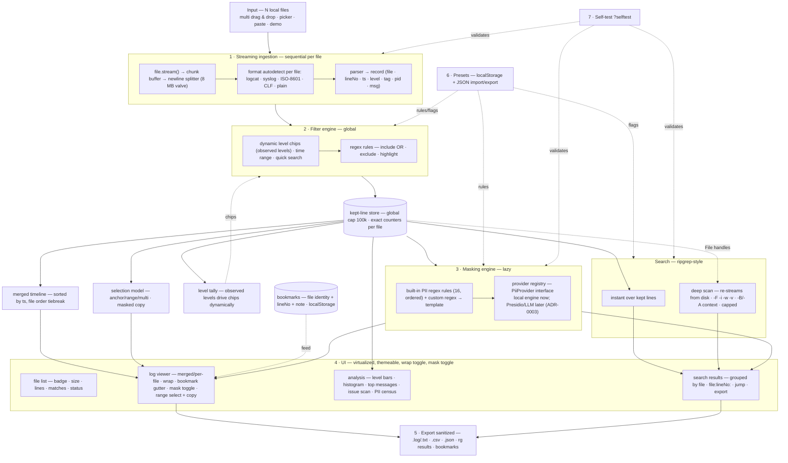

# Architecture

Log Triage is a single-file browser application assembled from small, Node-requireable UMD modules. The same modules power the Node test suite (`node --test`), the in-browser `?selftest` page, and the live UI. All state is local: the kept-line store, bookmarks, and presets live in memory or `localStorage`, and the original `File` handles are retained so deep scan can re-stream from disk.



## Module map

Each `src/*.js` is a UMD module: requireable in Node for TDD, loadable in the browser, and concatenated by `build.js` into the single HTML deliverable.

Implemented (G0–G1):

| Module | Responsibility |
| --- | --- |
| `src/util.js` | Shared helpers (hashing, formatting, small utilities reused by all modules). |
| `src/detect.js` | Format autodetection: logcat threadtime, syslog RFC 3164, Apache CLF, ISO-8601, bare MM-DD, plain. |
| `src/parser.js` | Parsers for the six formats; normalized records (`file · lineNo · ts · level · tag · pid · msg`) with year-less `MM-DD HH:MM:SS.mmm` timestamps. |
| `src/_src.js` | Node aggregator that exports all modules for tests and the coverage gate. |

Implemented in G2–G8:

| Module | Responsibility |
| --- | --- |
| `src/masks.js` | The 16 built-in ordered PII regex rules plus custom regex → template rules; lazy mask application. |
| `src/pii-provider.js` | `PiiProvider` interface, registry, and mock provider (see extension point below). |
| `src/filters.js` | Ordered include/exclude/highlight regex rules, case toggle, live hit counters. |
| `src/levels.js` | Dynamic level tally and chip generation from observed levels; "—" handling for unparseable lines. |
| `src/search.js` | Instant search over kept lines and ripgrep-style deep scan (`-F -i -w -v`, `-B/-A`, `-c/-l`), capped results. |
| `src/store.js` | Kept-line store: streaming ingestion valve, global cap, per-file counters, retained `File` handles. |
| `src/timeline.js` | Merged-timeline ordering (timestamp sort, file-order tiebreak) and the canvas histogram data. |
| `src/selection.js` | Selection model: anchor / shift-range / ctrl-toggle / ctrl+A; masked copy with optional `file:lineNo:` prefixes. |
| `src/bookmarks.js` | Bookmark storage keyed by file identity (name + size + first-line hash), notes, export/import. |
| `src/exporter.js` | Sanitized exports: `.log`/`.txt`, `.csv`, `.json`, rg results, bookmarks; timestamped filenames. |
| `src/themes.js` | Six themes via `body[data-theme]` CSS variables (Midnight default). |
| `src/selftest.js` | In-browser runner for the shared case suite (`?selftest`). |
| `src/app-*.js` | UI glue: file list, viewer, analysis tab, search results panel, presets UI (exempt from coverage gates). |

The shipped UI glue is the single module `src/app.js` (exempt from the coverage gate); the dev helpers `tools/serve.mjs` (static server), `tools/shots.mjs` (screenshot capture), and `tools/genbig.mjs` (big-log generator) support e2e and performance verification and contribute no runtime code.

## Build pipeline

`build.js` produces `log-triage.html` from a template plus module sources by simple concatenation — no bundler, no transpilation, no external dependencies.

- All `src/*.js` modules are UMD so the identical code runs in Node (tests, coverage gate) and the browser.
- Template tokens replaced at build time:
  - `__LT_VERSION__` — the current version string (kept in sync by `tools/bump.mjs` and the README marker `<!-- version: … -->`).
  - `/*__LT_CSS__*/` — inlined stylesheet.
  - `/*__LT_MODULES__*/` — concatenated UMD modules, in dependency order.
  - `/*__LT_CASES__*/` — the shared case suite (`tests/core-cases.js`) inlined for the `?selftest` page.
  - `/*__LT_DEMO__*/` — an inline demo log so the tool is explorable without any local files.

## Shared-case strategy

`tests/core-cases.js` is a plain UMD module defining named test cases (input → expected) over the core modules: detection, parsing, filtering, masking, search, timeline, export, and presets.

- `node --test` consumes the suite through `src/_src.js` and enforces coverage via `node tools/coverage-gate.mjs` (≥ 90% line, ≥ 85% branch per core module).
- `build.js` inlines the same file into `log-triage.html`; opening the app with `?selftest` runs it in the browser.
- Because both runners execute the identical suite, browser and Node behavior cannot drift apart — any behavior change must update one set of cases, and CI plus the in-page self-test report the same verdict.

## Data flow

1. **Ingestion (S1).** Each dropped file streams through `file.stream()` into a chunk buffer; a newline splitter with an 8 MB valve emits lines sequentially. Per file, the format is autodetected and each line is parsed into a normalized record. Unparseable lines are kept with level "—".
2. **Filtering (S2).** The global filter engine applies dynamic level chips (built from the observed-level tally), the inclusive time range, and ordered include/exclude/highlight regex rules. Only kept lines enter the store, subject to the global cap (default 100k), with exact per-file counters.
3. **Store fan-out.** The kept-line store feeds the level tally (chips), the merged timeline (timestamp sort, file-order tiebreak — null-timestamp lines such as stack traces attach to the preceding parsed line), the masking engine, the selection model, instant search, and the analysis tab. Retained `File` handles feed the deep scan independently of the store's contents.
4. **Masking (S3).** Masking is lazy: ordered built-in rules plus custom rules and any provider findings transform text only at render, copy, and export time; raw text is never rewritten in the store.
5. **Search (SR).** Instant search queries the kept lines; deep scan re-streams from disk with ripgrep-style flags and merges results grouped by file as `file:lineNo:`.
6. **UI (S4).** The virtualized viewer renders merged or per-file views with wrap, themes, severity tint, bookmarks, and selection; analysis renders level bars, histogram, clustered top messages, issue scan, PII census, and per-file comparison.
7. **Export (5).** The exporter serializes sanitized kept/selected lines, search results, and bookmarks to `.log`/`.txt`/`.csv`/`.json` with timestamped filenames.
8. **Presets (6).** Named sets of filter rules, mask rules, and search flags persist to `localStorage` and round-trip as JSON, feeding the filter engine, masking engine, and search.
9. **Self-test (7).** `?selftest` re-validates ingestion, masking, and search in the running build using the shared case suite.

## PII provider extension point

The masking engine is extensible behind a stable interface so new analysis backends can be added without touching the UI or the store:

```js
// PiiProvider
{
  id: "presidio",            // stable identifier; findings are tagged with it
  label: "Microsoft Presidio",
  local: true,               // true = machine-local; false = remote (opt-in required)
  available(): boolean,      // whether the backend can currently be used
  analyze(lines): findings[] // [{ start, end, type, score }] offsets into each line
}
```

- **Registry.** Providers register by `id`; the built-in local regex engine is simply the default provider. A mock provider ships in v1 to exercise the interface end to end.
- **Findings.** `analyze()` returns offset-based findings `{ start, end, type, score }`. The masking engine converts findings into redactions; the analysis tab's PII census aggregates them per rule and per provider. Every finding carries its provider id so provenance is always visible.
- **Future Presidio backend (proposed, ADR-0003).** Presidio would run as a localhost sidecar service on the user's machine — text still never leaves the machine, but the tool would talk to `localhost` over HTTP. `local: true`, gated behind an explicit user action.
- **Future LLM backend (proposed, ADR-0003).** An LLM backend is remote by definition: data would leave the machine. It must be explicit opt-in, off by default, and show a persistent warning whenever active. It is documented in v1 but not wired.
- **Security stance.** v1 ships with zero network code paths. The registry makes the boundary explicit (`local` flag), so any future remote provider is auditable: if `available()` can return true without the user having opted in, that is a bug.
